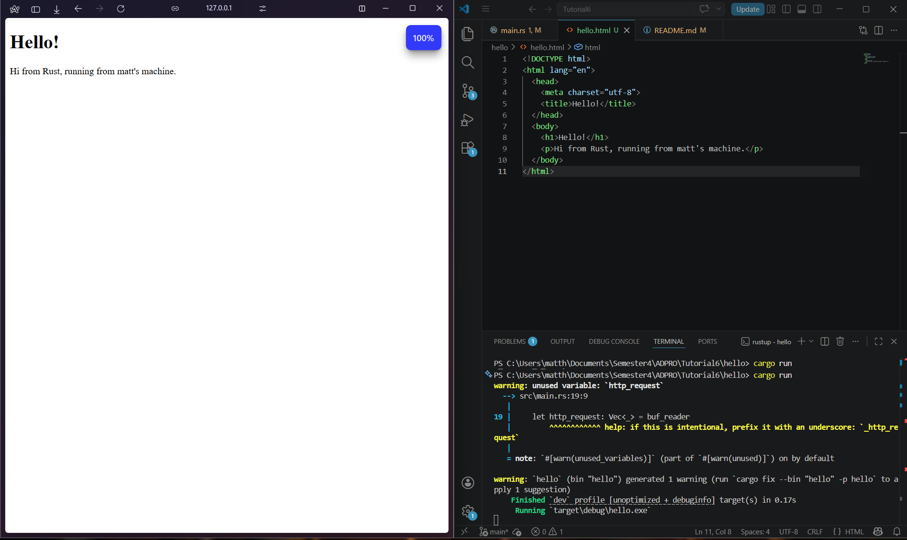

Berikut adalah versi yang lebih singkat, lebih objektif, dan menggunakan pilihan kata yang profesional namun tetap mudah dipahami:

1. **`let buf_reader = BufReader::new(&mut stream);`**
   Membaca *raw bytes* langsung dari `TcpStream` kurang efisien. Oleh karena itu, *mutable reference* dari *stream* dibungkus dengan `BufReader` sebagai *buffer* agar data bisa dibaca baris demi baris dengan lebih optimal.

2. **`buf_reader.lines()`**
   *Method* ini membuat *iterator* yang mengembalikan tiap baris data dalam format `Result<String, std::io::Error>`. Pemisahan baris dilakukan secara otomatis setiap kali fungsi mendeteksi karakter *newline* (`\n`).

3. **`.map(|result| result.unwrap())`**
   Karena kembalian dari `lines()` berbentuk `Result` (bisa mengindikasikan sukses atau *error*), `map` digunakan untuk mengekstrak isinya. Penggunaan `.unwrap()` di sini mengasumsikan tidak ada *error* saat membaca, sehingga nilai `String` langsung diambil.

4. **`.take_while(|line| !line.is_empty())`**
   Dalam protokol HTTP, *request line* dan *header* dipisahkan dari *body* oleh satu baris kosong (`\r\n`). *Iterator* ini akan terus mengambil data *sampai* menemukan baris kosong tersebut, untuk memastikan hanya bagian *request line* dan *header* yang ditangkap.

5. **`.collect()`**
   Fungsi ini mengakhiri proses iterasi dengan mengumpulkan semua *string* yang didapat ke dalam sebuah *dynamic array* (`Vec<_>`). *Compiler* Rust secara otomatis akan mengenali tipe datanya sebagai `Vec<String>`.

6. **`println!("Request: {:#?}", http_request);`**
   Terakhir, vektor yang berisi kumpulan *request* dicetak ke terminal. *Format specifier* `{:#?}` digunakan untuk men-*debug* dan menampilkan isi *collection* secara lebih rapi dan terstruktur (*pretty-print*).

   ## Commit 2 Reflection Notes

   

Pada tahap ini, kita memodifikasi fungsi `handle_connection` agar *server* tidak hanya membaca *request*, tetapi juga mengirimkan balasan (*response*) berupa file HTML ke *browser*. Berikut adalah insight yang didapat:

1. **`fs::read_to_string("hello.html")`**
   Kita menggunakan *module* `fs` (File System) bawaan Rust untuk membaca seluruh isi file `hello.html`. Fungsi ini akan langsung mengubah isi teks di dalam file tersebut menjadi sebuah tipe data `String` yang siap diolah.

2. **Memahami Format HTTP Response**
   Protokol HTTP memiliki format baku yang harus diikuti agar *browser* bisa membaca balasan kita. Formatnya adalah:
   * **Status Line:** `HTTP/1.1 200 OK` (menandakan *request* berhasil).
   * **Headers:** Informasi tambahan tentang data yang dikirim.
   * **Baris Kosong (`\r\n\r\n`):** Pemisah wajib antara *headers* dan isi konten (*body*).
   * **Body:** Konten utama, dalam hal ini adalah teks HTML kita.
   Kita menggunakan makro `format!` di Rust untuk merangkai bagian-bagian ini secara dinamis.

3. **Pentingnya Header `Content-Length`**
   Kita menghitung panjang *string* HTML menggunakan `contents.len()` dan memasukkannya ke dalam *header* `Content-Length`. Ini sangat penting karena *header* ini memberi tahu *browser* ukuran pasti dari data yang sedang dikirim. Tanpa ini, *browser* mungkin akan kebingungan menentukan kapan proses penerimaan data benar-benar selesai.

4. **`stream.write_all(response.as_bytes())`**
   Jaringan TCP mengirimkan data dalam wujud *raw bytes*, bukan teks *string* biasa. Oleh karena itu, variabel `response` yang tadinya berupa `String` harus dikonversi terlebih dahulu menggunakan metode `.as_bytes()`. Setelah itu, `write_all` akan memastikan seluruh *bytes* tersebut dikirimkan kembali melalui koneksi *stream* ke *browser* pengguna.