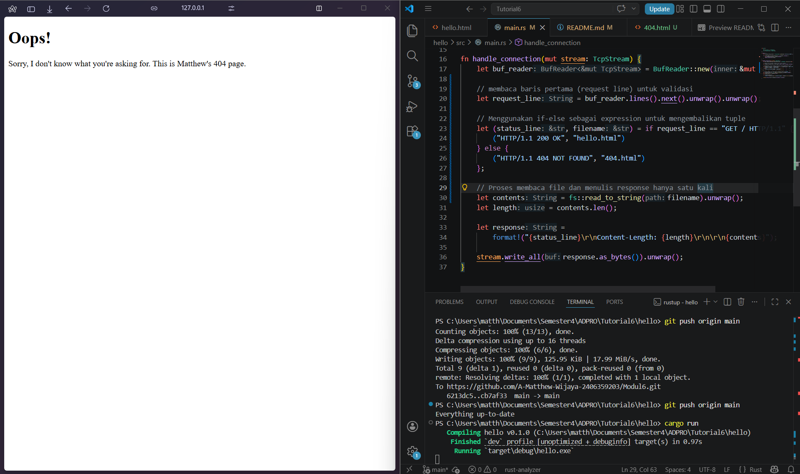

Berikut adalah versi yang lebih singkat, lebih objektif, dan menggunakan pilihan kata yang profesional namun tetap mudah dipahami:

1. **`let buf_reader = BufReader::new(&mut stream);`**
   Membaca *raw bytes* langsung dari `TcpStream` kurang efisien. Oleh karena itu, *mutable reference* dari *stream* dibungkus dengan `BufReader` sebagai *buffer* agar data bisa dibaca baris demi baris dengan lebih optimal.

2. **`buf_reader.lines()`**
   *Method* ini membuat *iterator* yang mengembalikan tiap baris data dalam format `Result<String, std::io::Error>`. Pemisahan baris dilakukan secara otomatis setiap kali fungsi mendeteksi karakter *newline* (`\n`).

3. **`.map(|result| result.unwrap())`**
   Karena kembalian dari `lines()` berbentuk `Result` (bisa mengindikasikan sukses atau *error*), `map` digunakan untuk mengekstrak isinya. Penggunaan `.unwrap()` di sini mengasumsikan tidak ada *error* saat membaca, sehingga nilai `String` langsung diambil.

4. **`.take_while(|line| !line.is_empty())`**
   Dalam protokol HTTP, *request line* dan *header* dipisahkan dari *body* oleh satu baris kosong (`\r\n`). *Iterator* ini akan terus mengambil data *sampai* menemukan baris kosong tersebut, untuk memastikan hanya bagian *request line* dan *header* yang ditangkap.

5. **`.collect()`**
   Fungsi ini mengakhiri proses iterasi dengan mengumpulkan semua *string* yang didapat ke dalam sebuah *dynamic array* (`Vec<_>`). *Compiler* Rust secara otomatis akan mengenali tipe datanya sebagai `Vec<String>`.

6. **`println!("Request: {:#?}", http_request);`**
   Terakhir, vektor yang berisi kumpulan *request* dicetak ke terminal. *Format specifier* `{:#?}` digunakan untuk men-*debug* dan menampilkan isi *collection* secara lebih rapi dan terstruktur (*pretty-print*).

   ## Commit 2 Reflection Notes

   

Pada tahap ini, kita memodifikasi fungsi `handle_connection` agar *server* tidak hanya membaca *request*, tetapi juga mengirimkan balasan (*response*) berupa file HTML ke *browser*. Berikut adalah insight yang didapat:

1. **`fs::read_to_string("hello.html")`**
   Kita menggunakan *module* `fs` (File System) bawaan Rust untuk membaca seluruh isi file `hello.html`. Fungsi ini akan langsung mengubah isi teks di dalam file tersebut menjadi sebuah tipe data `String` yang siap diolah.

2. **Memahami Format HTTP Response**
   Protokol HTTP memiliki format baku yang harus diikuti agar *browser* bisa membaca balasan kita. Formatnya adalah:
   * **Status Line:** `HTTP/1.1 200 OK` (menandakan *request* berhasil).
   * **Headers:** Informasi tambahan tentang data yang dikirim.
   * **Baris Kosong (`\r\n\r\n`):** Pemisah wajib antara *headers* dan isi konten (*body*).
   * **Body:** Konten utama, dalam hal ini adalah teks HTML kita.
   Kita menggunakan makro `format!` di Rust untuk merangkai bagian-bagian ini secara dinamis.

3. **Pentingnya Header `Content-Length`**
   Kita menghitung panjang *string* HTML menggunakan `contents.len()` dan memasukkannya ke dalam *header* `Content-Length`. Ini sangat penting karena *header* ini memberi tahu *browser* ukuran pasti dari data yang sedang dikirim. Tanpa ini, *browser* mungkin akan kebingungan menentukan kapan proses penerimaan data benar-benar selesai.

4. **`stream.write_all(response.as_bytes())`**
   Jaringan TCP mengirimkan data dalam wujud *raw bytes*, bukan teks *string* biasa. Oleh karena itu, variabel `response` yang tadinya berupa `String` harus dikonversi terlebih dahulu menggunakan metode `.as_bytes()`. Setelah itu, `write_all` akan memastikan seluruh *bytes* tersebut dikirimkan kembali melalui koneksi *stream* ke *browser* pengguna.

   ## Commit 3 Reflection Notes

Pada tahap ini, kita menambahkan fitur *routing* dasar agar *server* bisa memvalidasi *request* dan memberikan *response* yang berbeda (mengembalikan halaman sukses atau halaman *error* 404). Berikut adalah perubahan yang ada:

1. **Memisahkan Response (Pengecekan Request)**
   Kita mengekstrak baris pertama dari HTTP *request* menggunakan `.next().unwrap().unwrap()` yang berisi tipe *method* dan *path* tujuan (misalnya `GET / HTTP/1.1`). Dengan mengecek baris ini menggunakan blok `if-else`, *server* bisa menentukan:
   * Jika *request* adalah `/` (halaman utama), gunakan status `200 OK` dan kembalikan `hello.html`.
   * Jika *request* mengarah ke *path* lain (misalnya `/bad`), gunakan status `404 NOT FOUND` dan kembalikan `404.html`.

2. **Perlu Refactoring karena**
   Jika kita menulis logika secara mentah di dalam blok `if-else`, kita akan menuliskan kode `fs::read_to_string`, penghitungan `len()`, makro `format!`, dan `stream.write_all` secara berulang (dua kali: satu di dalam `if`, satu di dalam `else`). 
   
   Hal ini melanggar prinsip **DRY (*Don't Repeat Yourself*)**. Melalui *refactoring*, kita menyadari bahwa yang berbeda dari kedua skenario tersebut hanyalah **status line** dan **nama file**-nya saja. Oleh karena itu, di Rust kita bisa menggunakan blok `if` sebagai *expression* yang mengembalikan nilai (dalam bentuk *tuple*). Variabel-variabel unik ini ditarik ke atas, sehingga proses membaca file dan membalas *stream* cukup ditulis **satu kali** saja di paling bawah. Kode jadi jauh lebih rapi, terpusat, dan mudah di-*maintain*.

   ## Commit 4 Reflection Notes

Pada commit ini, kita mensimulasikan apa yang terjadi jika ada sebuah *request* yang memakan waktu lama untuk diproses (seperti mengambil data yang berat dari *database* atau memproses file besar) pada server berbasis *single-thread*.

Berikut adalah poin-poin yang dapat dipelajari dari simulasi lambat ini:

1. **Routing dengan `match`**
   Karena jumlah *route* bertambah (sekarang ada `/`, `/sleep`, dan *error* 404), kita mengganti `if-else` menjadi `match`. Di Rust, `match` lebih elegan dan aman karena memaksa kita untuk menangani semua kemungkinan pola data (*exhaustive pattern matching*). Kita menggunakan `&request_line[..]` untuk melakukan *matching* pada nilai *string slice*.

2. **Simulasi Proses Berat (`thread::sleep`)**
   Ketika ada *request* ke *endpoint* `/sleep`, server akan memanggil `thread::sleep(Duration::from_secs(10))`. Ini secara harfiah akan menghentikan eksekusi kode di *thread* tersebut selama 10 detik penuh sebelum melanjutkan pengiriman *response*.

3. **Kelemahan *Single-Threaded Server***
   Ketika kita membuka dua *tab* *browser*—satu mengakses `127.0.0.1:7878/sleep` dan satu lagi mengakses `127.0.0.1:7878/` (halaman normal) secara berurutan—halaman normal tersebut **ikut tertahan** (*loading* terus-menerus). 
   
   Hal ini terjadi karena server berjalan di atas *single thread*. Ketika *thread* tersebut sedang sleep selama 10 detik untuk menangani pengguna pertama, pengguna kedua yang meminta halaman normal yang seharusnya ringan harus rela menunggu *thread* tersebut bangun kembali. Ini menunjukkan mengapa server di tingkat produksi nyata (*production ready*) membutuhkan arsitektur *multi-threading* atau asinkron (*asynchronous*) agar *request* baru tidak terblokir oleh *request* sebelumnya yang lambat.

   ## Commit 5 Reflection Notes

Pada tahap ini, kita menyelesaikan masalah *single-thread* dengan mengimplementasikan `ThreadPool`.

1. **Konsep ThreadPool**
   Alih-alih membuat *thread* baru setiap kali ada *request* (yang bisa membuat server overload), kita menyiapkan sejumlah *thread* yang sudah "standby". Di sini kita membuat 4 *workers*.

2. **mpsc (Multiple Producer, Single Consumer) Channel**
   Kita menggunakan *channel* sebagai alat komunikasi. `ThreadPool` bertindak sebagai *sender* dan *workers* bertindak sebagai *receiver*.

3. **Arc dan Mutex**
   Karena ada 4 *workers* yang menunggu di ujung *receiver* yang sama, *receiver* tersebut harus bisa di*share* secara aman ke banyak *thread*.
   * `Arc` (Atomic Reference Counted) memungkinkan beberapa *thread* memiliki *ownership* (kepemilikan) referensi memori yang sama.
   * `Mutex` memastikan hanya ada satu *worker* yang membuka gembok (*lock*) dan mengambil sebuah *job* di satu waktu tertentu, sehingga tidak ada dua *worker* yang berebut mengerjakan tugas yang sama.

Dengan arsitektur ini, ketika `127.0.0.1:7878/sleep` diakses, hanya 1 *worker* yang sleep selama 10 detik. Tiga *worker* sisanya tetap bebas untuk melayani *request* halaman normal secara instan.
